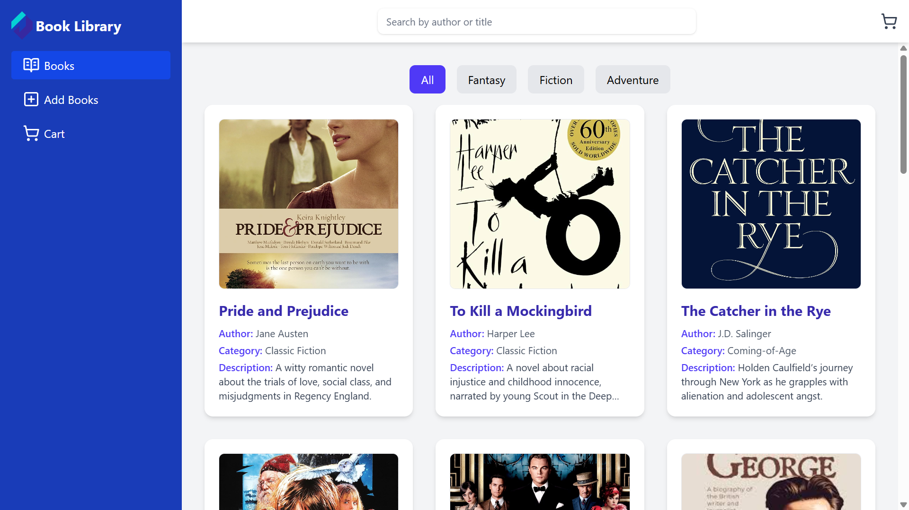

# 📚 Book Management Dashboard

A fully responsive and feature-rich **Book Management Dashboard** built with **React**, **Redux**, **Tailwind CSS**, and **React Router**, offering a seamless experience to browse, filter, add to cart, and manage a collection of books. Supports both static and locally added books with persistent localStorage support.

---
##  📸ScreenShorts
| 
---
## 🚀 Features

- 🔍 **Search by Title or Author**
- 📁 **Category-based Filtering** (`All`, `Fantasy`, `Fiction`, `Adventure`, etc.)
- 🛒 **Redux-powered Cart Functionality**
- ➕ **Add Custom Books (locally stored)**
- 🧹 **Delete Books from List or Cart**
- 🖼️ **Book Cover Image Support**
- 📱 **Fully Responsive UI**
- 🧭 **React Router Navigation**
- 💾 **LocalStorage Integration** for persistent state

---

## 🛠 Tech Stack

- ⚛️ React
- 🌐 React Router
- 📦 Redux Toolkit
- 💅 Tailwind CSS
- 💽 localStorage
- 🎨 Lucide React Icons

---

## 📂 Folder Structure

📦src
 ┣ 📁components
 ┃ ┣ 📄Header.jsx
 ┃ ┗ 📄Sidebar.jsx
 ┣ 📁pages
 ┃ ┣ 📄Home.jsx
 ┃ ┣ 📄AddBook.jsx
 ┃ ┣ 📄Cart.jsx
 ┃ ┗ 📄SingleBook.jsx
 ┣ 📁layout
 ┃ ┗ 📄DashboardLayout.jsx
 ┣ 📁slices
 ┃ ┣ 📄bookSlice.js
 ┃ ┗ 📄cartSlice.js
 ┣ 📄App.jsx
 ┣ 📄main.jsx
 ┗ 📄store.js


### Installation

```bash
git clone https://github.com/Developer200010/BookManagementDashboard.git
cd BookManagementDashboard
npm install
npm run dev